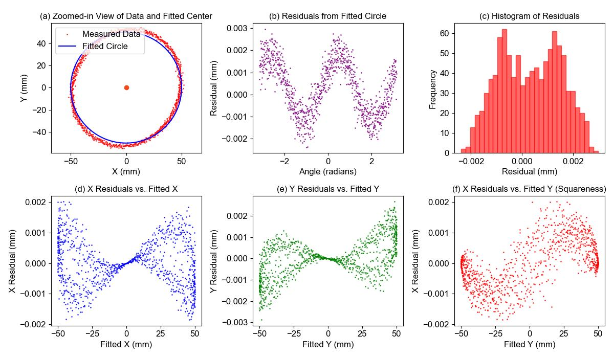

# Error Source Identification for Metrology Digital Twins

This code is part of the EURAMET ViDit project 22DIT01, task 2.1.6, developed by Gengxiang CHEN (gengxiang.chen@univ-paris13.fr) and Charyar Mehdi-Souzani from USPN. It implements a data-driven approach for error source identification in metrology digital twin systems, specifically focusing on Virtual CMM (Coordinate Measuring Machine) [1]. The Virtual CMM simulation code and parameters configuration come from the project partner [VSL](https://gitlab1.ptb.de/vidit-group/vidit/-/tree/main/WP1/Benchmark/CMM) from WP1.

## Overview
The virtual entity of the metrology digital twin enables the generation of sufficient virtual experimental data. These data can help to understand how different error source parameters influence the final measurement results. 
This code implements a Transformer-based neural network to classify error sources and predict error parameters from virtual CMM measurement data. The model is trained on synthetic data generated from a Virtual CMM simulation, allowing it to learn the relationships between the measurement results and error source parameters.
The code provides two main functions:
1. Classification of error sources: Identifies which error source (x-scale, y-scale, or squareness) is abnormal based on measurement data
2. Regression analysis for error prediction: Predicts the exact values of error parameters (Sx, Sy, Sxy) from measurement data

## Some Details

### Model Architecture
- Input: 5-dimensional measurement data (x, y coordinates and residuals)
- Convolutional layers: 3 layers with batch normalisation and leaky ReLU activation
- Transformer encoder: 2 layers with 4 attention heads
- Positional encoding: Sinusoidal encoding for sequence position information
- Output: Classification (4 classes) or regression (error parameters)

### Data Generation
The virtual measurement data can be generated with `script/dataset_generation.py`. The data sample includes:
- Single circle measurement with radius r = 50mm
- 1000 measurement points
- Input features: x-coordinate, y-coordinate, x-residual, y-residual, and radial residual

The samples are generated with different error parameters, categorised into four classes:
- **Category 0 (Normal)**:
  - Sx, Sy, Sxy ~ N(0, 5e-5)
- **Category 1 (Abnormal Squareness Error)**:
  - Sxy ~ N(2e-4, 5e-5)
  - Sx, Sy ~ N(0, 5e-5)
- **Category 2 (Abnormal X-Scale Error)**:
  - Sx ~ N(2e-4, 5e-5)
  - Sy, Sxy ~ N(0, 5e-5)
- **Category 3 (Abnormal Y-Scale Error)**:
  - Sy ~ N(2e-4, 5e-5)
  - Sx, Sxy ~ N(0, 5e-5)

- **Dataset size**:
  - 600 training samples
  - 200 testing samples


### Performance Metrics
- Classification: Accuracy, per-class accuracy, confusion matrix
- Regression: Mean Absolute Error (MAE), Root Mean Square Error (RMSE)

## Usage

### Classification Task
```bash
python main_classification.py --model Transformer --target label --batch_size 20 --epochs 100 --task OneCircle
```

### Regression Task
```bash
python main_regression.py --model Transformer --target squareness --batch_size 50 --epochs 100 --task OneCircle
```

For regression tasks, you can specify which error parameter to predict using the `--target` parameter:
- `squareness`: Predict squareness error (Sxy)
- `scale_x`: Predict x-axis scale error (Sx)
- `scale_y`: Predict y-axis scale error (Sy)

### Key Parameters
- `--model`: Model type (Transformer)
- `--target`: Target variable (for classification: 'label'; for regression: 'squareness', 'scale_x', 'scale_y')
- `--batch_size`: Batch size for training
- `--epochs`: Number of training epochs
- `--task`: Task type ('OneCircle' or 'TwoCircles')

### Sample Analysis Example
Below is an example of a normal sample analysis, showing the measurement points and their characteristics:



## Dependencies

The code requires the following Python packages:
- PyTorch (>= 1.8.0)
- NumPy (>= 1.19.0)
- Pandas (>= 1.2.0)
- Matplotlib (>= 3.3.0)
- scikit-learn (>= 0.24.0)

## Contact

### About Code
For questions and issues related to this code implementation, please contact:
- Gengxiang CHEN (gengxiang.chen@univ-paris13.fr)

### About Virtual CMM
For questions about the Virtual CMM simulation and parameters configuration, you can also contact:
- Marcel van Dijk, VSL, mvandijk@vsl.nl

